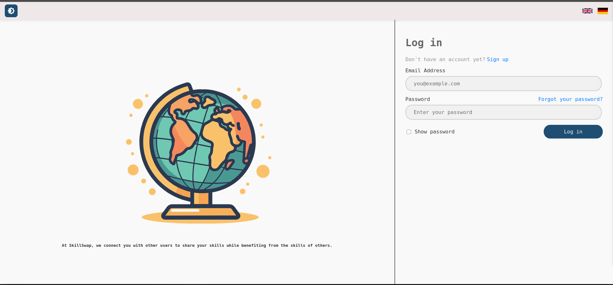
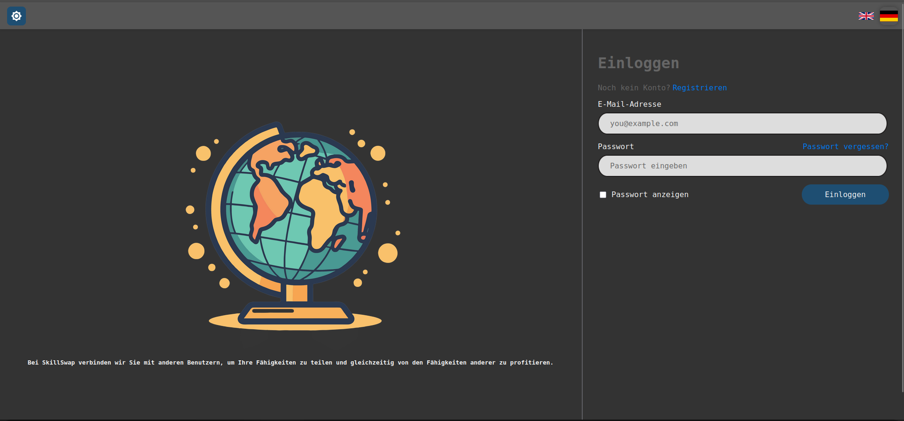
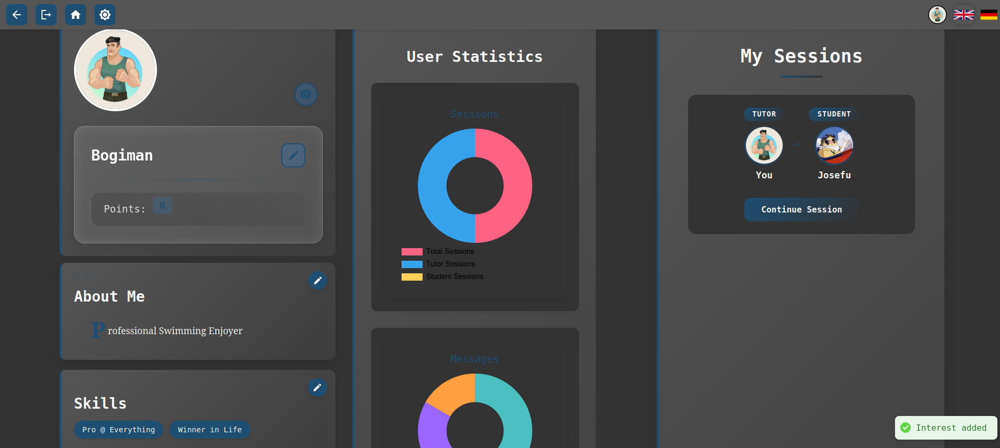
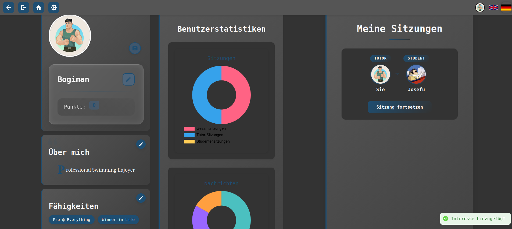
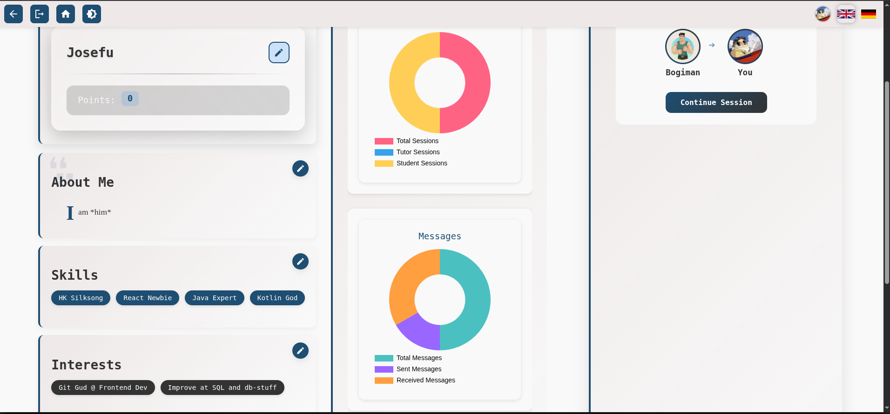
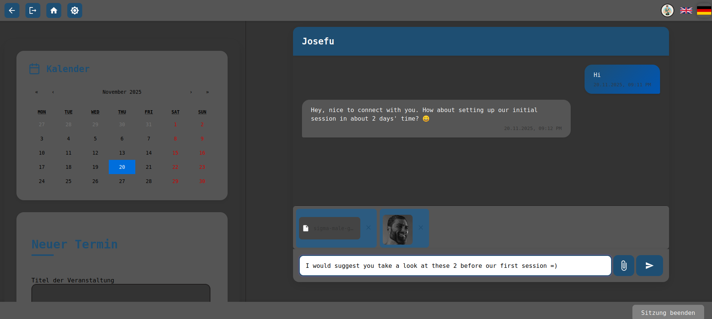

# FWE SkillSwap

SkillSwap is a small web platform that combines peer-to-peer learning with light gamification.  
Users can offer and book sessions, exchange skills, give feedback, and earn points for helping others.

This project was developed in winter 2024 as part of the **“Frontend-Web Entwicklung”** (“Frontend Web Development”)
course at **Hochschule Darmstadt** by a team of [four students](#team).

---

## Project Status

This is an educational university project built for a course.  
It is not actively maintained and is intended primarily as a demonstration of the tech stack and architecture.

---

## Tech Stack

**Frontend**

- React (Vite)
- TypeScript
- React Router
- Axios
- Socket.IO client

**Backend**

- Node.js & Express
- TypeScript
- MongoDB with Mongoose
- JSON Web Tokens (JWT) for auth
- bcrypt for password hashing
- Socket.IO for real-time features

---

## Screenshots

Some impressions from the app UI:


## Screenshots

Some impressions from the app UI:

**Login – light theme (English)**  


**Login – dark theme (German)**  


**Profile & statistics – dark theme (English)**  


**Profile & statistics – dark theme (German)**  


**Dashboard & sessions – light theme**  


**Calendar & chat with attachments**  



---

## Main Features

- User registration, login, and profile management
- Create and book skill-sharing sessions
- Basic calendar / session overview
- Gamification (points, simple leaderboard)
- Feedback & ratings for sessions
- Real-time messaging between users
- Basic personalization: light/dark mode and multilingual UI (English & German)

> 💡 **Note on uploads:**  
> The original course version used a cloud storage provider (Cloudinary) for profile pictures and chat attachments.  
> In this public version, uploads are stored locally in the backend container under `uploads/` and served via
`/uploads/...` to keep setup simple and avoid external services.

---

## Running the Project

You can run SkillSwap either via **Docker Compose** (quick start) or in a **local dev setup**.

### Option 1: Docker Compose (recommended for a quick look)

**Prerequisites**

- Docker & Docker Compose

**Steps**

```bash
git clone <this-repo-url>
cd <repo-folder>
````

Create the backend env file for Docker:

```bash
cp backend/.env.compose.template backend/.env.compose
# adjust values if needed (JWT secrets, etc.)
```

Then start everything:

```bash
docker compose up --build
```

* Frontend: [http://localhost:4173](http://localhost:4173)
* Backend API: [http://localhost:8000](http://localhost:8000)
* File uploads: served from [http://localhost:8000/uploads/](http://localhost:8000/uploads/)...

MongoDB runs in its own container; no local Mongo installation is required for this setup.

---

### Option 2: Local Development (without Docker)

**Prerequisites**

* Node.js (v16+)
* npm
* A running local MongoDB instance (default: `mongodb://localhost:27017`)

**Steps**

```bash
git clone <this-repo-url>
cd <repo-folder>
```

Backend:

```bash
cd backend
cp .env.template .env
# adjust MONGO_URI, JWT secrets, etc. if needed
npm install
npm run dev
```

Frontend (in a second terminal):

```bash
cd frontend
npm install
npm run dev
```

The frontend dev server will print the local URL (usually `http://localhost:5173`).

---

## Team

Developed collaboratively by four students at Hochschule Darmstadt:

* Backend development – Dias Baikenov, Bogdan Polskiy
* Frontend development – Arian Farzad, Yusuf Birdane

---

## License

This project is licensed under the **MIT License**.
For details, see the `LICENSE` file.
